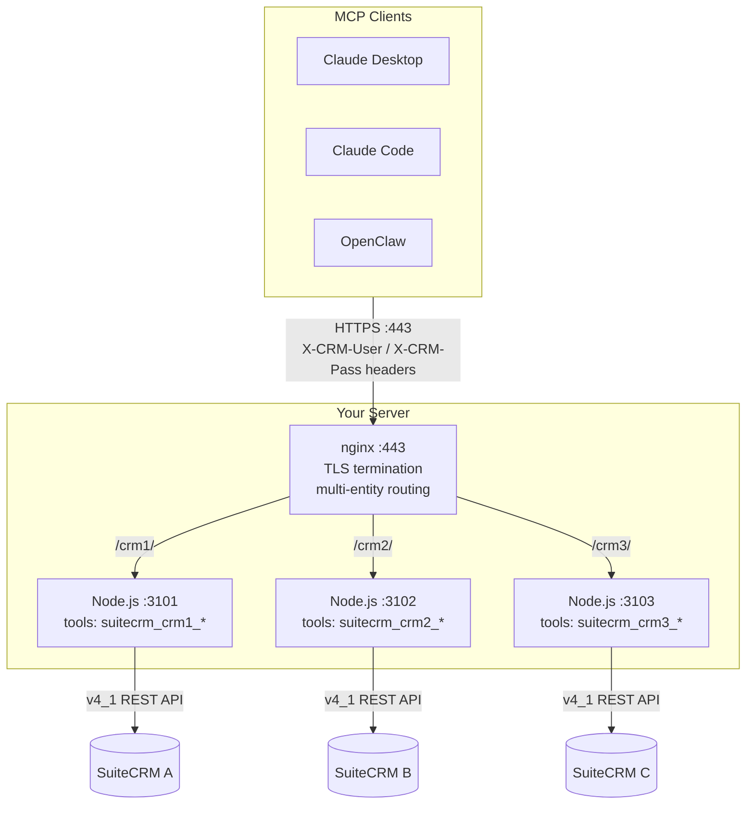
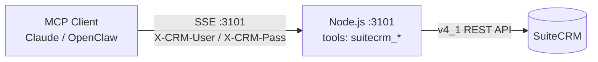

# suitecrm-mcp

An open-source MCP (Model Context Protocol) gateway for SuiteCRM. Lets AI assistants - Claude, OpenAI, or any MCP-compatible client - read and write your CRM data over a persistent SSE connection.

Built from a real production deployment. CData's version is commercial. This one isn't.

## Features

- **13 tools** covering the full CRUD surface: search, get, create, update, delete, count, relationships, module introspection
- **SSE transport** - compatible with Claude Desktop, Claude Code, and any MCP client that supports HTTP+SSE
- **Per-connection header auth** - credentials never stored server-side; each connection supplies its own
- **Session auto-renewal** - CRM sessions re-authenticate transparently on expiry
- **Two installers** - single CRM (no nginx) or N CRMs behind nginx, both as systemd services
- **Entity-prefixed tools** - run multiple CRM instances side-by-side without name collisions

## Tools

| Tool | Description |
|------|-------------|
| `{prefix}_search` | Search records using SQL WHERE clause |
| `{prefix}_search_text` | Full-text search across modules |
| `{prefix}_get` | Get a single record by UUID |
| `{prefix}_create` | Create a new record |
| `{prefix}_update` | Update an existing record |
| `{prefix}_delete` | Soft-delete a record |
| `{prefix}_count` | Count records matching a query |
| `{prefix}_get_relationships` | Get related records via a link field |
| `{prefix}_link_records` | Create a relationship between records |
| `{prefix}_unlink_records` | Remove a relationship |
| `{prefix}_get_module_fields` | Get field definitions for a module |
| `{prefix}_list_modules` | List all available CRM modules |
| `{prefix}_server_info` | Gateway status and connection info |

Replace `{prefix}` with your configured `SUITECRM_PREFIX` (default: `suitecrm`).

Supported modules include: Accounts, Contacts, Leads, Opportunities, Cases, Calls, Meetings, Tasks, Notes, Emails, Documents, Campaigns, AOS_Quotes, AOS_Invoices, AOS_Products, AOS_Contracts, AOR_Reports, AOW_WorkFlow, SecurityGroups - and any custom modules in your instance.

---

## Architecture

**Multi-entity** (N CRMs behind nginx):



**Single-entity** (direct port, no nginx):



*With `--domain`: nginx is added in front for automatic HTTPS termination - the client connects on :443 instead of :3101.*

Each Node.js process is a standalone systemd service. Credentials are never stored - each SSE connection authenticates independently and gets its own CRM session, which auto-renews on expiry and is cleaned up on disconnect.

---

## Prerequisites

- Ubuntu 20.04+ or Debian 11+ (the installers use `apt`, `systemd`, and `nginx`)
- Python 3.8+
- Root / sudo access
- Node.js is installed automatically if missing

---

## SuiteCRM API User Setup

Before connecting, make sure your CRM user has API access enabled:

1. Log into SuiteCRM as admin
2. Go to **Admin → User Management** → open the user you'll authenticate with
3. Check **"Is Admin"** OR set **"API User"** to Yes (the field name varies by SuiteCRM version)
4. Save

If API access isn't enabled, the gateway returns HTTP 401 with `CRM authentication failed: Invalid Login` immediately on connection - this is the most common first-run failure.

For production: create a dedicated API user with only the module permissions your AI assistant needs. Don't use the admin account.

---

## Docker

The fastest way to run the gateway without touching Node.js or system packages. A pre-built image is published to GitHub Container Registry on every push to `main`.

For production, pin to a release tag such as `v1.2.3` instead of floating on `latest`.

```bash
curl -o docker-compose.yml https://raw.githubusercontent.com/anirudhx7/suitecrm-mcp/v1.2.3/docker-compose.yml
```

Edit `docker-compose.yml` and set `SUITECRM_ENDPOINT` to your CRM's REST API URL, then:

```bash
docker compose up -d
```

The gateway runs at `http://localhost:3101/sse`. Docker pulls the image automatically - no clone needed.

To update to a newer pinned release, change the image tag in `docker-compose.yml` and redeploy:
```bash
docker compose pull && docker compose up -d
```

If you prefer a floating channel for labs or internal testing, change the image tag to `latest`.

For self-signed CRM certificates, add `NODE_TLS_REJECT_UNAUTHORIZED: "0"` to the environment block. For HTTPS termination, put a reverse proxy (nginx, Caddy) in front.

**Test it:**
```bash
curl -s -H "X-CRM-User: admin" -H "X-CRM-Pass: yourpassword" \
  http://localhost:3101/test
# Expected: {"success":true,"crm_user":"admin","prefix":"suitecrm"}
```

---

## Quick Start - Single CRM

For one CRM, no nginx. Connects directly to the port.

**Requirements:** Ubuntu/Debian, Python 3.8+, root access

```bash
git clone https://github.com/anirudhx7/suitecrm-mcp.git
cd suitecrm-mcp
sudo python3 install-single.py \
  --endpoint https://your-crm.example.com/service/v4_1/rest.php \
  --port 3101 \
  --prefix suitecrm \
  --label "My CRM"
```

After install, the gateway runs at `http://YOUR_SERVER:3101/sse`.

**Enable HTTPS (recommended for production):**

Add `--domain` and `--email` to the install command. The installer will set up nginx as a TLS-terminating reverse proxy and obtain a Let's Encrypt certificate automatically.

```bash
sudo python3 install-single.py \
  --endpoint https://your-crm.example.com/service/v4_1/rest.php \
  --port 3101 \
  --prefix suitecrm \
  --label "My CRM" \
  --domain mcp.yourserver.com \
  --email you@example.com
```

Requirements: the domain must already point to this server's public IP, and ports 80 and 443 must be open. The certificate renews automatically via the certbot systemd timer.

After HTTPS install, the gateway runs at `https://mcp.yourserver.com/sse`.

**Open the port** (if using ufw, HTTP-only installs only):
```bash
sudo ufw allow 3101/tcp
```

**Test credentials before connecting:**
```bash
curl -s -H "X-CRM-User: admin" -H "X-CRM-Pass: yourpassword" \
  http://YOUR_SERVER:3101/test
# Expected: {"success":true,"crm_user":"admin","prefix":"suitecrm"}
```

**Verify it's working in Claude Desktop:**

After adding the MCP server config (see [Connecting to Claude Desktop](#connecting-to-claude-desktop)) and restarting Claude Desktop, click the hammer icon in the bottom-left of the chat window. You should see 13 tools listed: `suitecrm_search`, `suitecrm_get`, etc.

Try a test prompt: `"List the first 5 accounts in the CRM"` - Claude should call `suitecrm_search` automatically.

---

## Multi-Entity Install

For N CRM instances behind nginx - each gets its own port and path.

**1. Copy and fill in the config:**
```bash
cp entities.example.json entities.json
# Edit entities.json with your CRM endpoints and ports
```

**2. Run the installer:**
```bash
sudo python3 install-multi.py --config entities.json
```

**3. Enable HTTPS (recommended for production):**

Pass `--domain` and `--email` to the installer. It will update the nginx config with your domain and run certbot automatically.

```bash
sudo python3 install-multi.py --config entities.json \
  --domain mcp.yourserver.com \
  --email you@example.com
```

The domain must already point to this server's public IP, and ports 80 and 443 must be open. After this step the gateway is available at `https://mcp.yourserver.com/<code>/sse`.

Once configured, the domain is saved automatically. Later `--add` and `--remove` runs preserve HTTPS without needing `--domain` again.

**4. Open the nginx port** (if using ufw, HTTP-only installs only):
```bash
sudo ufw allow 8080/tcp
```

**5. Test a specific entity:**
```bash
curl -s -H "X-CRM-User: admin" -H "X-CRM-Pass: yourpassword" \
  http://YOUR_SERVER:8080/crm1/test
# Expected: {"success":true,"crm_user":"admin","prefix":"suitecrm_crm1"}
```

**6. Connect at:** `http://YOUR_SERVER:8080/<code>/sse` (or `https://your-domain/<code>/sse` if HTTPS is enabled)

**Verify it's working in Claude Desktop:** After restarting Claude Desktop, click the hammer icon. You should see 13 tools per entity: `suitecrm_crm1_search`, `suitecrm_crm2_search`, etc.

**Add entities later (no downtime on existing):**
```bash
sudo python3 install-multi.py --add --config entities.json
```

**Remove an entity:**
```bash
sudo python3 install-multi.py --remove crm2
```

---

## Configuration

### Single entity - environment variables

| Variable | Required | Default | Description |
|----------|----------|---------|-------------|
| `SUITECRM_ENDPOINT` | Yes | - | Full URL to `/service/v4_1/rest.php` |
| `SUITECRM_PREFIX` | No | `suitecrm` | Tool name prefix |
| `PORT` | No | `3101` | Listen port |
| `SUITECRM_CODE` | No | - | Entity code for multi-entity nginx routing |
| `NODE_TLS_REJECT_UNAUTHORIZED` | No | - | Set to `0` only for self-signed certs |
| `NODE_NO_WARNINGS` | No | - | Set to `1` to suppress Node warnings |

### Multi-entity - entities.json

```json
{
  "crm1": {
    "label": "My Company CRM",
    "endpoint": "https://crm.mycompany.com/service/v4_1/rest.php",
    "port": 3101
  },
  "crm2": {
    "label": "Client B CRM",
    "endpoint": "https://crm.clientb.com/service/v4_1/rest.php",
    "port": 3102,
    "tls_skip": true
  }
}
```

Keys become the entity code (nginx path prefix, tool prefix suffix, service name). Ports must be unique.

---

## TLS

### Gateway HTTPS (Let's Encrypt)

Pass `--domain` and `--email` to either installer to enable HTTPS on the gateway itself. The installer sets up nginx as a TLS-terminating reverse proxy and runs certbot to obtain and auto-renew a certificate.

Requirements:
- Domain must already point to this server's public IP
- Ports 80 (ACME challenge) and 443 (HTTPS) must be open

If certbot fails during install, the gateway still runs over HTTP. Fix DNS/firewall and re-run:
```bash
certbot --nginx -d your.domain.com -m you@example.com --agree-tos --redirect
```

### Self-Signed CRM Certificates

If your SuiteCRM uses a self-signed certificate, add `"tls_skip": true` to the entity config (multi) or pass `--tls-skip` (single). This sets `NODE_TLS_REJECT_UNAUTHORIZED=0`.

Only use this on trusted internal networks. Never expose a TLS-skipping gateway to the public internet.

---

## Connecting a Client

Any MCP client that supports SSE transport with custom request headers will work.
Each client has a different setup process - see the dedicated guide for your client:

| Client | How it connects | Setup guide |
|--------|----------------|-------------|
| Claude Desktop | SSE direct - no bridge needed | [docs/connect-claude-desktop.md](docs/connect-claude-desktop.md) |
| Claude Code (CLI) | SSE direct - no bridge needed | [docs/connect-claude-code.md](docs/connect-claude-code.md) |
| OpenClaw | Bridge installer required | [docs/connect-openclaw.md](docs/connect-openclaw.md) |

**Claude Desktop and Claude Code** connect directly to the gateway URL over SSE.
After installing the gateway, add the SSE endpoint and your CRM credentials to
your client config. Full steps including single/multi entity configs, HTTPS
variants, and verification are in the guides above.

**OpenClaw** uses a two-component setup: the gateway runs on a remote server
(installed via `install-multi.py` or `install-single.py`) and a bridge plugin
runs locally on the OpenClaw machine (installed via `install-bridge.py`). The
bridge proxies all 13 SuiteCRM tools through to the gateway. The OpenClaw guide
covers both components end to end.

---

## Troubleshooting

**Check service status:**
```bash
sudo python3 install-single.py --status
# or
sudo python3 install-multi.py --status
```

**View logs:**
```bash
journalctl -u suitecrm-mcp -f          # single
journalctl -u suitecrm-mcp-crm1 -f     # multi
```

**Test auth without MCP:**
```bash
curl -H "X-CRM-User: admin" -H "X-CRM-Pass: password" \
  http://YOUR_SERVER:3101/test
```

**Common issues:**
- `CRM login failed` - wrong credentials, or the CRM user doesn't have API access enabled in SuiteCRM
- `Non-JSON response` - wrong endpoint URL, or the CRM is returning an error page; check the URL ends in `/service/v4_1/rest.php`
- `ECONNREFUSED` - the service isn't running; check `journalctl -u suitecrm-mcp`
- SSE connection drops - normal for long idle periods; clients reconnect automatically

---

## Supported SuiteCRM Versions

Tested on **SuiteCRM 8.8.x**. Should work on any SuiteCRM version that exposes the v4_1 REST API - this has been present since early SuiteCRM releases.

Does not support SugarCRM - the APIs diverged significantly after the SuiteCRM fork.

**Finding your endpoint URL**

The path to the REST API varies depending on how SuiteCRM was installed. Common patterns:

```
https://crm.example.com/service/v4_1/rest.php
https://crm.example.com/legacy/service/v4_1/rest.php
https://crm.example.com/crm/service/v4_1/rest.php
https://crm.example.com/crm/public/legacy/service/v4_1/rest.php
```

To find yours: log into SuiteCRM, go to **Admin → Diagnostic Tool** and look at the site URL, or check with whoever manages your server. The endpoint always ends in `/service/v4_1/rest.php` - only the prefix before it varies. Test it with:

```bash
curl -s -X POST "https://YOUR-PATH/service/v4_1/rest.php" \
  --data 'method=get_server_info&input_type=JSON&response_type=JSON&rest_data={}}'
# Should return: {"flavor":"CE","version":"...","gmt_time":"..."}
```

---

## Known Limitations

**LDAP / SSO users cannot authenticate via the REST API**

SuiteCRM's v4_1 REST API only authenticates against local database passwords. If your organisation uses LDAP, Active Directory, or SSO, users who log into the CRM web UI via those providers will not have a local password set - and the gateway will return `CRM login failed: Invalid Login` for them even with correct credentials.

**Workaround:** Create a dedicated local API user directly in the SuiteCRM database (not via LDAP). This user exists only for API access and is not tied to your SSO provider.

This is a SuiteCRM REST API limitation, not specific to this gateway.

---

## Security Notes

- **HTTPS is required for production.** Credentials travel as HTTP headers, and the SuiteCRM v4_1 REST API requires passwords to be sent as MD5 hashes. MD5 is cryptographically broken - without HTTPS, credentials are trivially interceptable. Use `--domain` to enable Let's Encrypt, or put the gateway behind a reverse proxy with a valid TLS certificate.
- **Query sanitisation.** The `search` and `count` tools accept a SQL WHERE clause. The gateway blocks destructive SQL keywords (DROP, ALTER, DELETE, etc.) and comment/statement-chaining patterns as a defense-in-depth measure. SuiteCRM's own API layer provides additional protection.
- Env files are written with mode `600` and the env directory with `700`
- `entities.json` is in `.gitignore` - never commit it

---

## License

<a href="https://github.com/Anirudhx7/suitecrm-mcp/blob/55c7985e1d67dd2fd49f6c793608d2380c107a7e/LICENSE">MIT</a> 
